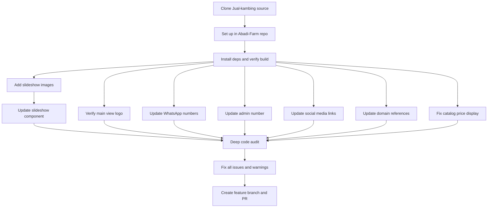

# Abadi Farm Website Migration and Customization Plan

## Overview
Migrate the website from the source repository `targetingsmart-droid/Jual-kambing` into `abadifarmyogyakarta/Abadi-Farm`, then customize branding, content, contact info, social links, fix UI issues, and perform a deep code audit.

---

## Phase 1: Repository Migration

### Step 1 - Clone source and set up project
- Clone `https://github.com/targetingsmart-droid/Jual-kambing.git` contents into the Abadi-Farm workspace
- Preserve the full project structure including all source files, configs, and assets
- Install dependencies and verify the project builds successfully
- Examine the framework used -- likely Next.js or similar given Vercel deployment

---

## Phase 2: Slideshow Update

### Step 2 - Add slideshow images
- User will upload 3 image files to the repository:
  - **Image 1**: Abadi Farm Yogyakarta banner -- dark gradient background with gold text, tagline about Kambing Kurban and Aqiqah
  - **Image 2**: Tingkatan/Tier chart -- Bronze, Silver, Gold, Platinum, Diamond tiers with weight ranges
  - **Image 3**: Goat photo -- brown/white goat on wooden platform with farm backdrop
- Place images in the project assets/images directory with descriptive names like `slide-banner.jpg`, `slide-tiers.jpg`, `slide-goat.jpg`

### Step 3 - Update slideshow component
- Locate the slideshow/carousel component in the codebase
- Replace existing slide image references with the 3 new images
- Ensure proper aspect ratio, responsive sizing, and smooth transitions
- Test that the slideshow auto-rotates and manual navigation works

---

## Phase 3: Main View Logo

### Step 4 - Verify and restore Abadi Farm logo on main view
- The main view should display the Abadi Farm circular logo as shown in Image 4/screenshot
- The logo already exists in the source repo -- confirm it is properly referenced
- Ensure the logo is centered above the ABADI FARM heading text
- Maintain the dark green background section with the logo, heading, subtitle, and Lihat Katalog button
- Keep the badge items: 500+ Terjual, 100% Halal, Gratis Ongkir

---

## Phase 4: Contact Information Updates

### Step 5 - Update WhatsApp ordering number
- Search all files for existing WhatsApp number references
- Replace with `+62 813-2626-3563` -- the raw format for WhatsApp API links is `6281326263563`
- Update all `wa.me/` links, WhatsApp API URLs, and display text
- This applies to: catalog Pesan via WhatsApp buttons, floating WhatsApp button, any contact sections

### Step 6 - Update admin phone number
- Search for any admin/contact phone numbers throughout the codebase
- Replace all instances with `+62 813-2626-3563`
- Check config files, environment variables, and hardcoded values

---

## Phase 5: Social Media and Location Links

### Step 7 - Update all social media links
Update each social link across the site -- footer, navigation, contact sections, etc.

| Platform | New URL |
|----------|---------|
| Facebook | `https://www.facebook.com/profile.php?id=61570725302501` |
| Instagram | `https://www.instagram.com/abadifarmyogyakarta?igsh=MWw5ZzFkZGIxNWhmeg==` |
| TikTok | `https://www.tiktok.com/@abadifarmyka?_r=1&_t=ZS-95d3xXofz4a` |
| Google Maps | `https://maps.app.goo.gl/MAWeWqroUU73nsPm8` |

- Search for all existing social media URL patterns and replace them
- Verify all links open correctly in new tabs with `target="_blank"` and `rel="noopener noreferrer"`

---

## Phase 6: Domain Configuration

### Step 8 - Configure Vercel domain
- Update any hardcoded domain references in the codebase from the old domain to `abadifarm.store`
- Check for canonical URLs, meta tags, Open Graph URLs, sitemap references
- Update `vercel.json` or project config if domain aliases are specified there
- Note: actual Vercel dashboard domain configuration is done outside the codebase

---

## Phase 7: Catalog Price Display Fix

### Step 9 - Fix truncated price display
Based on the screenshot, the catalog cards show prices like `Rp 4.600.000` and `Rp 7.000.000` being cut off at the bottom of cards. Issues to fix:

- **Card height**: Ensure catalog cards have sufficient height or use `min-height` / auto-height to prevent content overflow
- **Price text**: Ensure the price element has adequate padding/margin at the bottom
- **Responsive layout**: The 2-column grid on mobile needs cards that fully contain all content
- **Overflow handling**: Remove any `overflow: hidden` that clips price text, or adjust card dimensions
- **Font sizing**: Consider if the large price font size needs adjustment on smaller screens
- **Bottom spacing**: Add adequate bottom padding inside the card before the WhatsApp button

---

## Phase 8: Deep Code Audit and Fixes

### Step 10 - Analyze all scripts for issues
- Run linting tools -- ESLint, TypeScript compiler checks
- Check for console warnings and errors
- Review all components for:
  - Missing `key` props in lists
  - Missing `alt` attributes on images
  - Unused imports and variables
  - Deprecated API usage
  - Accessibility issues -- ARIA labels, semantic HTML
  - Performance issues -- unoptimized images, missing lazy loading
  - SEO issues -- meta tags, structured data

### Step 11 - Fix identified issues
- Fix all ESLint errors and warnings
- Fix TypeScript type errors if applicable
- Optimize image loading with next/image or lazy loading
- Ensure proper error boundaries
- Clean up dead code and unused dependencies
- Verify mobile responsiveness across all sections

---

## Phase 9: Final Steps

### Step 12 - Push and create PR
- Create a feature branch: `feature/migration-and-customization`
- Commit all changes with descriptive messages
- Push to remote and create a pull request
- Verify CI checks pass

---

## Architecture Diagram

## Key Files to Modify
These are estimated based on typical Next.js project structure -- exact paths will be confirmed after cloning:

- **Slideshow**: Component file containing carousel/slider -- likely in `components/` or `sections/`
- **Main hero section**: Component with logo, heading, CTA button
- **Catalog/product cards**: Component rendering the product grid with prices
- **Footer**: Social media links, contact info
- **Config/constants**: Phone numbers, URLs, domain references
- **Layout/head**: Meta tags, canonical URLs, OG tags
- **package.json**: Dependencies review
- **vercel.json**: Domain configuration if present

## Risk Areas
- The source repo may have hardcoded values scattered across multiple files -- thorough search is critical
- Image optimization needs to match the existing loading strategy
- Price display fix needs to be tested across multiple screen sizes
- Social media URL special characters in query params need proper encoding
